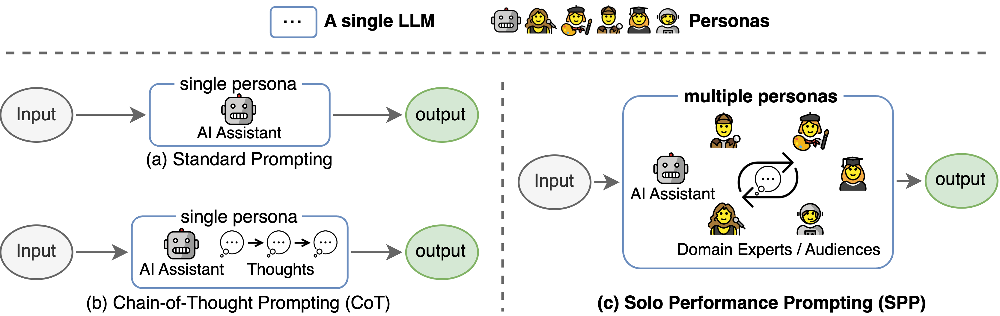

# Official Repo of paper [Solo Performance Prompting (SPP)](https://arxiv.org/abs/2307.05300)

 

## Setup
- Install dependencies
    ```
    pip install -r requirements.txt
    ```
- Set up OpenAI API configs in `config_template.sh` and run `source config_template.sh` to set up the env variables (Note that we are using the Azure API in our experiments)

## Quick Start
We provide running scripts for each of the three tasks, please check out the comments in the ".sh" scripts for more information: 
- Trivia Creative Writing: `bash scripts/trivia_creative_writing.sh`
- Codenames Collaborative: `bash scripts/codenames_collaborative.sh`
- Logic Grid Puzzle: `bash scripts/logic_grid_puzzle.sh`

## Prompts
All prompts can be found in the `prompts/` folder. 

## Datasets
All datasets can be found in the `data/` folder.

## Paper Experiment Results
Experimental results in the paper for each task can be found in the `logs/` folder. Each task has two subdirs `w_sys_mes` and `wo_sys_mes` indicating the two inference settings: with and without the system message: "You are an AI assistant that helps people find information.".

### Log file formats

- `"test_output_infos"`: contains evaluation metrics for each instance, e.g., # correct answers mentioned.
- `"prompt"``: full input prompt for the API call. (for Codenames task, there are two API calls for each instance)
- `"*raw_responses"`: raw responses from each API call. 
- `"*parsing_flag"`: whether the raw response is successfully parsed. (for Codenames task, this field is seperated into "parsing_success_flag_spymaster" and "parsing_success_flag_guesser")
- `"unwrapped_output"`: parsed output that will be used for computing evaluation metrics. (for Codenames task, this field is seperated into "spymaster_output" and "guesser_output"; there is an additional field named "hint_word" which is parsed from the spymaster's output and inserted into the Guesser's input; the evaluation metric is computed based on the "guesser_output")
- `"task data"`: data for the current task instance, e.g., quetions, answers, target words, etc.
- `"usage"`: logging for the number of tokens and cost spended so far.
- other self-explanatory config fields: "model", "method", "temperature", etc.

## Citations
Please cite the paper and star this repo if you find this work interesting/helpful.
```
@article{wang2023unleashing,
  title={Unleashing Cognitive Synergy in Large Language Models: A Task-Solving Agent through Multi-Persona Self-Collaboration},
  author={Wang, Zhenhailong and Mao, Shaoguang and Wu, Wenshan and Ge, Tao and Wei, Furu and Ji, Heng},
  journal={arXiv preprint arXiv:2307.05300},
  year={2023}
}
```

## Acknowledgements
This codebase referenced the structure of the [Tree-of-thought official repo](https://github.com/princeton-nlp/tree-of-thought-llm). We thank the authors for their open-sourcing efforts.

